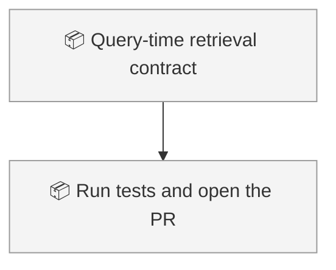
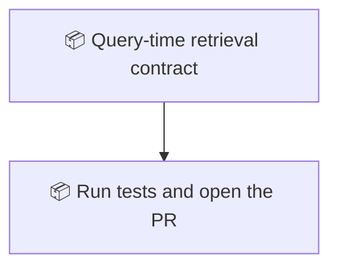

<!-- GENERATED by worklog roadmap-render. DO NOT EDIT. -->

> This file is generated from `.work/todo.jsonl`. Edits will be overwritten.
> To change the roadmap, change the work items: `worklog add|update|close`.

# Roadmap

_1 epic(s) in flight, 1 open item(s), 0 blocked, 0 unclassified._

## Now

_Nothing here._

## Next

### Query-time retrieval contract  ·  P1  ·  4 of 5 done
Generalize the query-time retrieval contract into second-brain-core so every ContentPack shares one isolation story. Scripts stay the engine. Pack-specific retriever agents stay in their packs.

| # | Item | Type | Priority | Status | Blocked by |
|---|---|---|---|---|---|
| 01M2BB3A | Run tests and open the PR | task | P2 | todo | — |

## Later

_Nothing here._

## Visual roadmap

### Dependency graph

### Hierarchy

